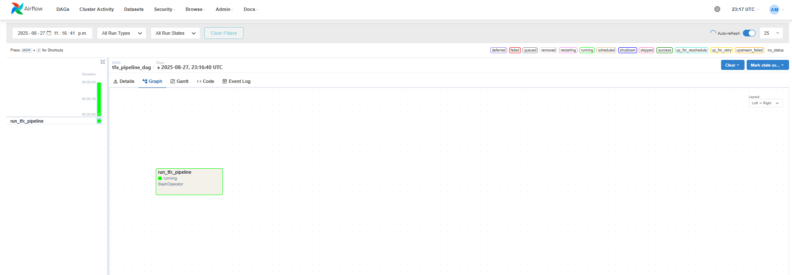
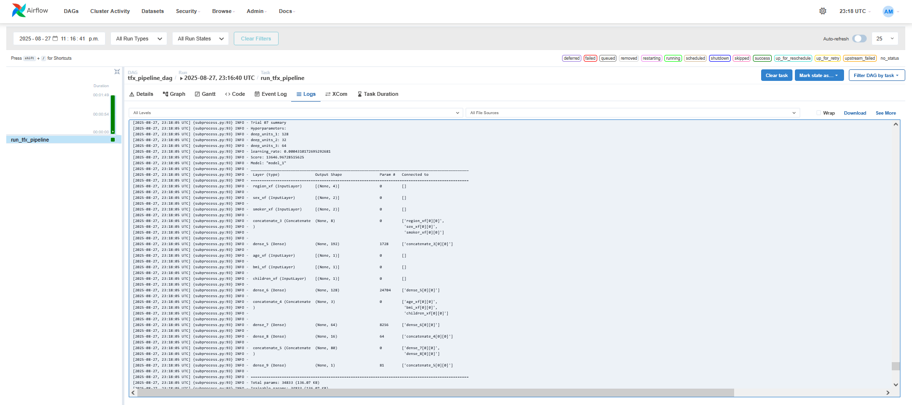
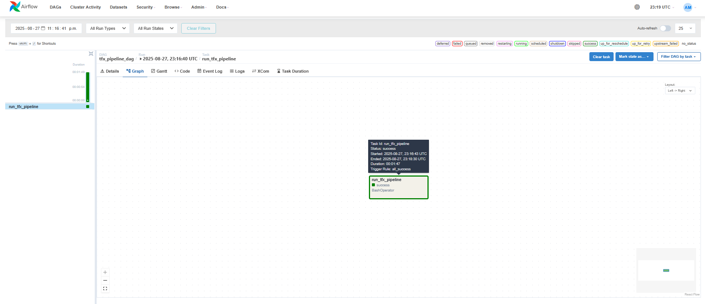

# 📌 AirflowTFX: End-to-End MLOps Pipeline

> End-to-end TFX pipeline for medical insurance cost prediction, orchestrated via Apache Airflow to automate and reproduce ML workflows at scale.

## 📖 Overview
 - This project implements a **10-stage TFX ML pipeline** for **medical insurance cost (charges) prediction**, orchestrated with Apache Airflow for automated, repeatable execution.
 - Adapted from the reference implementation in *Building Machine Learning Pipelines* (Hapke & Nelson, 2020), using a custom dataset with tailored preprocessing, a Wide & Deep Keras model, and Keras Tuner hyperparameter search.
 - Developed in a **local Airflow environment** (non-containerized) with SQLite-backed ML Metadata for artifact versioning and pipeline caching.
 - Due to hard dependency conflicts between Airflow and TFX, the TFX pipeline runs inside a **dedicated virtual environment** invoked from within the Airflow DAG via a `BashOperator`, isolating both toolchains cleanly.

---

## 🏢 Business Impact
Notebook-based ML workflows lack task dependency management, schema validation, and consistent preprocessing between training and serving — leading to training-serving skew and non-reproducible results. This project demonstrates how structured TFX pipelines orchestrated by Airflow eliminate those gaps: every run is traceable, every artifact is versioned, data anomalies are caught at ingestion, and the model is gated by automated evaluation before deployment — reducing manual intervention and providing the foundation for production-ready ML infrastructure.

---

## 🚀 Features
✅ **End-to-End Pipeline Automation:** All 10 stages from raw CSV ingestion to model deployment execute in a single Airflow DAG trigger.  
✅ **Schema Validation & Anomaly Detection:** TFDV infers a feature schema from training data and flags anomalies before any transformation or training begins.  
✅ **Training/Serving Consistency:** TF Transform builds a preprocessing graph applied identically at training time and baked into the saved model for serving, eliminating skew.  
✅ **Automated Hyperparameter Tuning:** Keras Tuner RandomSearch optimizes the Wide & Deep model architecture and learning rate before the final training run.  
✅ **Gated Model Promotion:** TFMA evaluates each new model against a production baseline on MAE/MSE/RMSE; only a blessed model is pushed to the serving directory.  
✅ **Environment Isolation Architecture:** Airflow and TFX run in separate virtual environments, resolving real-world dependency conflicts while preserving full DAG orchestration.  

---

## ⚙️ Tech Stack
| Technology                   | Purpose                                                        |
| ---------------------------- | -------------------------------------------------------------- |
| `Python 3.9`                 | Core programming language for all pipeline components          |
| `TensorFlow 2.11`            | Deep learning backend for model definition and training        |
| `TensorFlow Extended (TFX)`  | Standardized 10-stage ML pipeline framework                    |
| `Apache Airflow 2.7`         | DAG orchestration, task dependency management, and scheduling  |
| `TF Data Validation (TFDV)`  | Dataset statistics, schema inference, and anomaly detection    |
| `TF Transform (TFT)`         | Preprocessing graph for training/serving consistency           |
| `TF Model Analysis (TFMA)`   | Post-training evaluation with metric thresholds and gating     |
| `Keras Tuner`                | Hyperparameter search (RandomSearch) for the Wide & Deep model |
| `pandas`                     | Data manipulation and CSV preparation                          |
| `SQLite`                     | ML Metadata store for artifact versioning and pipeline caching |

---

## 📂 Project Structure
<pre>
📦 AirflowTFX - Reproducible ML Pipeline Orchestration with TensorFlow Extended
 ┣ 📂 Airflow
 ┃ ┗ 📂 dags
 ┃   ┗ 📜 TFX_Pipeline_DAG.py
 ┣ 📂 data
 ┃ ┗ 📂 span-1
 ┃   ┣ 📂 eval
 ┃   ┃ ┗ 📜 eval.csv
 ┃   ┗ 📂 train
 ┃     ┗ 📜 train.csv
 ┣ 📂 imgs
 ┃ ┣ 📜 AirflowTFX.png
 ┃ ┣ 📜 ppln_dag.png
 ┃ ┣ 📜 ppln_run_log.png
 ┃ ┗ 📜 ppln_succ_run.png
 ┣ 📜 base_pipeline.py
 ┣ 📜 module.py
 ┣ 📜 pipeline_run.py
 ┣ 📜 requirements_airflow.txt
 ┣ 📜 requirements_tfx.txt
 ┣ 📜 LICENSE
 ┗ 📜 README.md
</pre>

> **Why two requirements files?** Airflow and TFX cannot coexist in a single virtual environment due to hard dependency conflicts. `requirements_airflow.txt` targets the Airflow venv; `requirements_tfx.txt` targets the TFX venv. The Airflow DAG bridges them by activating the TFX venv via a `BashOperator` at runtime.

---

## 🛠️ Installation

1️⃣ **Clone the Repository**
<pre>
git clone https://github.com/real-ahmed-moussa/AirFlowTFX.git
cd AirFlowTFX
</pre>

2️⃣ **Create and Populate the TFX Virtual Environment**
<pre>
python3.9 -m venv tfx_venv
source tfx_venv/bin/activate
pip install -r requirements_tfx.txt
deactivate
</pre>

3️⃣ **Create and Populate the Airflow Virtual Environment**
<pre>
python3.9 -m venv airflow_venv
source airflow_venv/bin/activate
pip install -r requirements_airflow.txt
</pre>

4️⃣ **Initialize Airflow and Copy the DAG**
<pre>
export AIRFLOW_HOME=~/airflow
airflow db init
cp Airflow/dags/TFX_Pipeline_DAG.py ~/airflow/dags/
</pre>

5️⃣ **Set Environment Variables**
<pre>
export TFX_VENV_PATH=/absolute/path/to/tfx_venv
export TFX_PIPELINE_SCRIPT=/absolute/path/to/AirFlowTFX/pipeline_run.py
</pre>

6️⃣ **Start Airflow Services**
<pre>
airflow scheduler                         # Run in terminal 1
airflow webserver --port 8080             # Run in terminal 2; UI at http://localhost:8080
</pre>

7️⃣ **Trigger the Pipeline DAG**
<pre>
airflow dags trigger tfx_pipeline_dag
</pre>

---

## 📂 Pipeline Runs
### Pipeline DAG (compiled TFX pipeline in Airflow UI)

  

### Pipeline Run Log (sample)

  

### Successful Pipeline Run

  

---

## 📊 Results
 - **Prediction Task:** Regression model for medical insurance cost (charges) prediction using age, BMI, children, sex, region, and smoker status.
 - **Pipeline Coverage:** All 10 TFX stages automated — ExampleGen, StatisticsGen, SchemaGen, ExampleValidator, Transform, Tuner, Trainer, Model Resolver, Evaluator, and Pusher.
 - **Evaluation Metrics:** TFMA tracks MAE, MSE, and RMSE per run; model promotion is gated by a MAE change threshold requiring that each new model not regress against the production baseline.
 - **Reproducibility:** SQLite-backed ML Metadata caches artifacts across runs, ensuring consistent reruns and full lineage traceability.
 - **Scalability Improvement:** Structured pipeline execution eliminates training-serving skew and manual notebook steps, delivering a reproducible, auditable baseline for production ML workflows.

---

## 📝 License
This project is shared for portfolio purposes only and may not be used for commercial purposes without permission.
